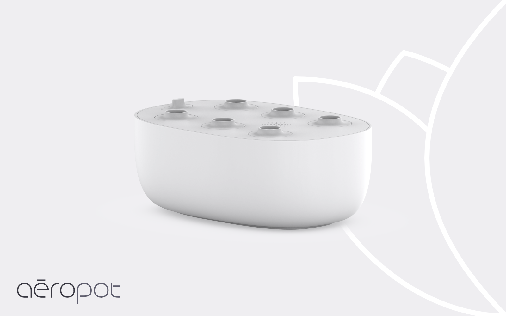
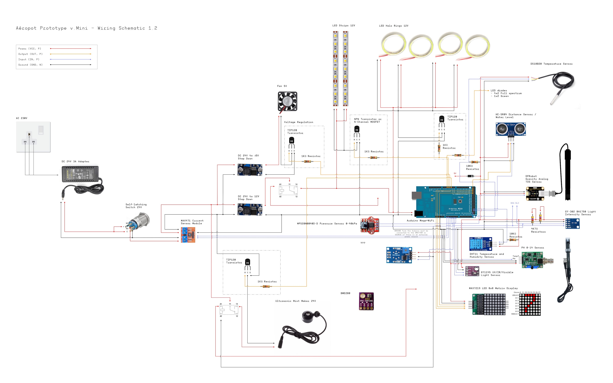
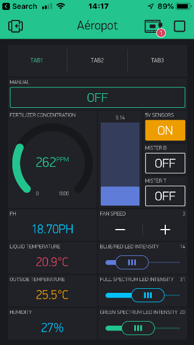
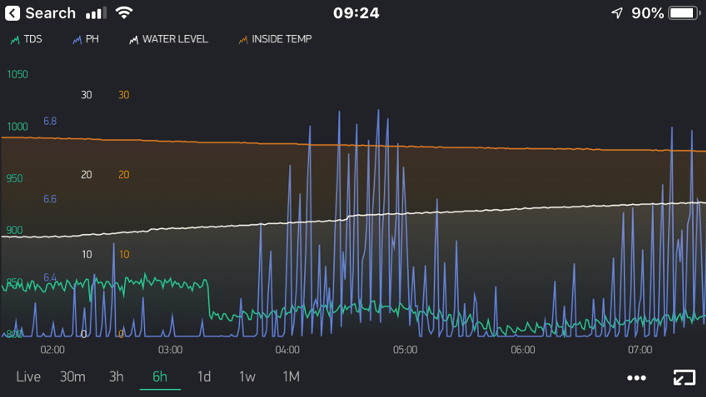
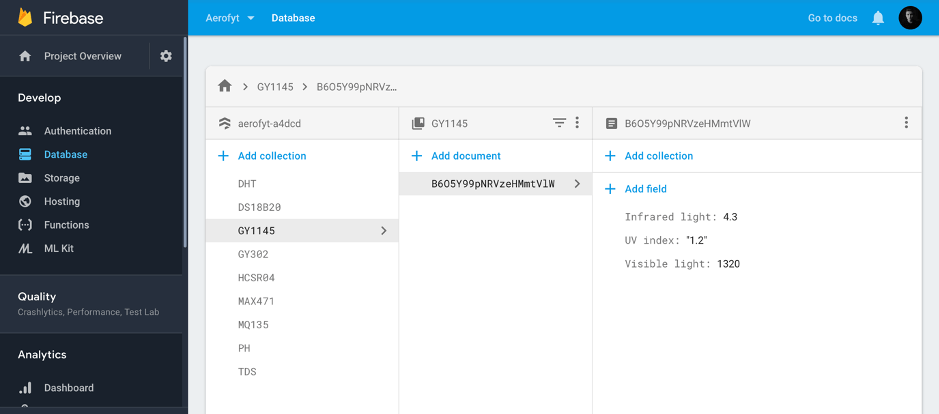

**Aéropot** is a smart ultraponic system for indoor plant cultivation

The prototype of the planter was built with electronic parts that were readily available on the market.

This repository includes source code for connecting the **Arduino Mega R3 (RobotDyn)** microcontroller with **[Blynk.io](http://blynk.io)** IoT platform and **Firebase** database.

Written in C/C++.

Planter
------

Wiring schematic
------

Blynk app
------

Firebase
------

